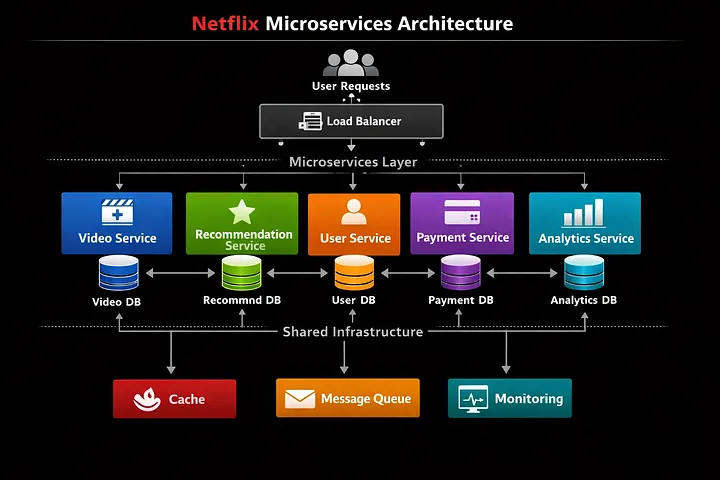
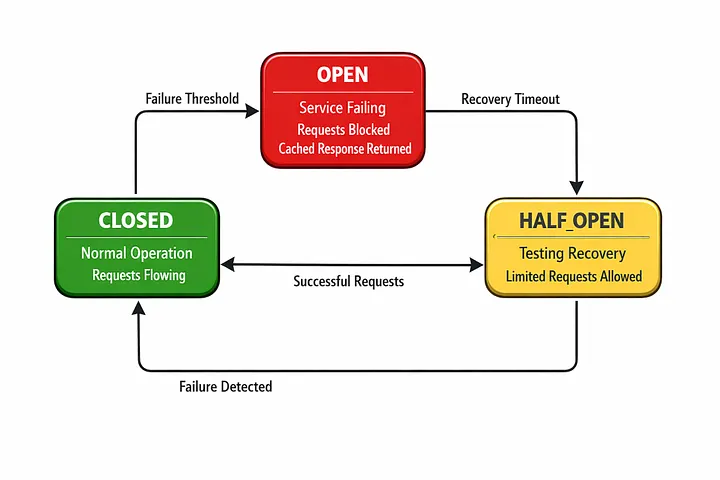

# Netflix架构背后的系统设计原则


Netflix服务于190个国家超过2.5亿用户。每天，它们处理数十亿次请求，流式传输数PB的数据，并保持99.99%的运行率。

他们是怎么做到的？

这不是魔法。这是系统设计。

## 为什么Netflix的架构如此重要

Netflix不仅仅是一个流媒体服务。这是一堂分布式系统设计的教科书课。理解Netflix如何构建架构，教会你适用于任何大型系统的原则。

根据Netflix的公共科技博客，他们已经发布了数百篇关于其工程决策的文章。这些不是理论概念——而是经过实战考验的真实问题解决方案。

## 五大核心原则

Netflix的架构建立在五个基本原则之上，每位高级工程师都应理解这些原则。

### 1. 微服务架构

Netflix开创了微服务运动。他们没有构建一个单一的应用程序，而是构建了数百个独立服务。

**为什么？因为：**

- **独立扩展** —— 每个服务根据自身需求进行扩展
- **技术灵活性** —— 不同服务可以使用不同的语言和数据库
- **故障隔离** —— 一个服务失败并不会让整个系统崩溃
- **团队自主性** —— 团队可以独立部署，无需与其他人协调

根据CNCF云原生计算基金会的数据，企业微服务的采用率从2016年的20%增长到2024年的85%。Netflix是早期的先驱之一。



> Netflix的架构：独立服务拥有自己的数据库，通过共享基础设施相互连接。每个服务都可以独立扩展。

**权衡呢？** 复杂性。你不再只是管理一个应用程序。你要管理数百个服务，每个服务都有自己的数据库、部署流水线和监控。

**Netflix的解决方案：** 构建工具和平台来管理这些复杂性。

### 2. 通过混沌工程实现韧性

Netflix发明了混沌工程。这个想法简单却强大：在生产环境中故意破坏，找出弱点，防止它们变成真正的失败。

他们的工具 **Chaos Monkey** 会随机终止生产中的实例。这迫使工程师建造能够在故障中存活的系统。

**这点很重要的原因如下：**

在微服务架构中，故障是不可避免的。你的数据库会宕机。你的网络会有延迟峰值。你的服务内存会用完。问题不是“是否”会发生这些事情，而是“何时”。

**Netflix的做法：** 假设失败是默认状态。构建优雅退化的系统。

**示例原理：断路器。** 当下游服务失败时，停止调用，返回缓存响应，而不是超时。



> 断路器模式：三种状态（闭合、开合、半开）用于防止连锁故障。

```rust
// Simple circuit breaker pattern
struct CircuitBreaker {
    failure_count: u32,
    threshold: u32,
    state: CircuitState,
}

enum CircuitState {
    Closed,      // Normal operation
    Open,        // Service is failing, reject calls
    HalfOpen,    // Testing if service recovered
}

impl CircuitBreaker {
    fn call(&mut self, request: Request) -> Result<Response> {
        match self.state {
            CircuitState::Open => {
                // Service is down, return cached response
                return Ok(cached_response());
            }
            CircuitState::Closed => {
                // Normal operation, make the call
                match make_request(request) {
                    Ok(resp) => {
                        self.failure_count = 0;
                        Ok(resp)
                    }
                    Err(e) => {
                        self.failure_count += 1;
                        if self.failure_count >= self.threshold {
                            self.state = CircuitState::Open;
                        }
                        Err(e)
                    }
                }
            }
            CircuitState::HalfOpen => {
                // Testing recovery, make the call
                match make_request(request) {
                    Ok(resp) => {
                        self.state = CircuitState::Closed;
                        self.failure_count = 0;
                        Ok(resp)
                    }
                    Err(e) => {
                        self.state = CircuitState::Open;
                        Err(e)
                    }
                }
            }
        }
    }
}
```

这种模式在Netflix的整个基础设施中都被采用。当服务出现困难时，断路器会打开，防止连锁故障。

### 3. 可观察性优先于监控

Netflix不仅监控他们的系统。他们观察着他们。

**有什么区别？**

- 监控会告诉你有问题：“CPU在95%。”
- 可观测性告诉你错误的原因：“CPU剩95%，因为服务X每秒向服务Y发送1万个请求，导致延迟500毫秒，导致请求排队。”

Netflix开发了**Atlas**用于指标，**Vizceral**用于可视化服务依赖。这些工具为工程师提供了对系统行为的全面可视化。

**这为什么重要？** 因为在微服务架构中，问题并不总是显而易见。服务A中的数据库查询速度较慢可能导致服务B超时，进而导致服务C的失败。没有可观察性，你就是盲飞。

### 4. 数据驱动架构决策

Netflix不会猜测。他们测量。

Netflix的每一项架构决策都以数据为依据：

- 这个服务每秒能处理多少请求？
- P99延迟是多少（第99百分位）？
- 运行费用是多少？
- 失败率是多少？

根据Netflix的工程博客，他们每月运行数千次A/B测试。这也延伸到基础设施决策。

**举例：** Netflix测试了不同的数据库技术（SQL、NoSQL、专用数据库）以适应不同的用例。他们没有选出一个“最佳”数据库。他们为每项工作挑选了合适的工具：

- **Cassandra** 用于高写工作负载（用户活动，推荐）
- **DynamoDB** 用于快速键值查找（用户偏好）
- **Elasticsearch** 用于搜索和分析
- **PostgreSQL** 用于事务数据（计费、账户）

每一个选择都是基于数据，而非基于意见。

### 5. 自动化与基础设施作为代码

Netflix自动化了一切。部署、扩展、恢复、监控——全部自动化。

**为什么？** 因为手动流程无法扩展。当你管理跨多个区域的数千台服务器时，不能让人工来部署。

Netflix 使用：

- **Spinnaker** 用于持续部署
- **Titus** 用于容器编排
- **Eureka** 用于服务发现
- **Hystrix** 用于容错

这些都是Netflix开发并发布给社区的开源工具。

**原则是：** 如果你做的事情不止一次，就自动化它。如果你是手动操作的，那你就没有在扩展。

## 建筑实践

以下是这些原则的协同作用：

1. 用户请求视频 → 负载均衡器将路由到最近的区域
2. 微服务接收请求 → 服务独立，可以独立扩展
3. 下游服务调用 → 断路器防止故障
4. 如果服务变慢 → 可观测性工具会准确说明原因
5. 如果服务失效 → 混沌工程已经做好准备
6. 如果流量激增 → 自动化会自动扩展实例
7. 所有决策被跟踪 → 数据显示哪种方法最有效

这就是为什么Netflix能以99.99%的运行率服务2.5亿用户。

> Netflix的规模：2.5亿+用户，190个国家，99.99%的正常运行率，每日数十亿请求。

## 这对你的职业生涯意味着什么

理解Netflix的架构原则不仅仅是学术上的事。这直接适用于你的工作：

1. **学习微服务** —— 这现已成为大型系统的标准
2. **理解韧性模式** —— 断路器、隔板、重试至关重要
3. **在系统中构建可观察性** —— 不仅仅是监控，要观察
4. **做出数据驱动决策** —— 在优化前先测量
5. **自动化一切** —— 手动流程无法扩展

根据Stack Overflow 2024年的调查，系统设计是高级工程师最受重视的技能。了解Netflix的策略能为你带来竞争优势。

## 主要要点

Netflix的架构并非因为他们想复杂才复杂。事情复杂，因为他们必须大规模解决真正的问题。

但原则很简单：

- 构建独立的服务，这些服务可以失败而不摧毁系统
- 假设失败并建立韧性
- 观察一切，这样你才能知道发生了什么
- 做出基于数据的决策，而不是猜测
- 自动化一切，避免人力成为瓶颈

无论你是在打造初创企业还是管理Netflix的基础设施，这些原则都适用。

## 主要资料与参考文献

- [Netflix 技术博客](https://netflixtechblog.com/) —— 官方 Netflix 工程博客
- [Chaos Monkey on GitHub](https://github.com/Netflix/chaosmonkey) —— Netflix的混沌工程工具
- [Atlas 度量系统](https://github.com/Netflix/atlas) —— Netflix 的时间序列度量数据库
- [Vizceral 可视化](https://github.com/Netflix/vizceral) —— Netflix的服务依赖可视化工具
- [Spinnaker 部署](https://spinnaker.io/) —— Netflix的持续部署平台
- [Eureka 服务发现](https://github.com/Netflix/eureka) —— Netflix 的服务发现系统
- [Hystrix 容错](https://github.com/Netflix/Hystrix) —— Netflix 的断路器库
- CNCF云原生调查 —— 微服务和云原生实践的行业采纳情况
- Stack Overflow 开发者调查 2024 —— 系统设计作为一项重要技能

