Outbox 模式的核心思想是：**将"写 DB"和"发事件"合并到同一个本地事务中**，通过一张 `outbox` 表做中间人，再由独立进程异步投递消息，从而把分布式一致性问题降级为单机事务问题。

下面是架构全景图：---



### 为什么原有双写会出问题

`BEGIN → 写 DB → COMMIT → 发 Kafka` 这条链路在 COMMIT 和 produce 之间存在一个窗口：进程崩溃、网络超时或 Broker 不可用，都会导致 DB 已提交但消息没发出去；反过来重试时又可能重复发送。两步操作永远不在同一个原子单元里。

---

### Outbox 模式的核心设计

**关键思路**：把"写业务表"和"写待发消息"合并进同一个本地事务。这样数据库的 ACID 保证了两张表要么同时提交、要么同时回滚，彻底消除不一致窗口。

**Outbox 表结构**（MySQL 示例）：

```sql
CREATE TABLE outbox_events (
  id          BIGINT        PRIMARY KEY AUTO_INCREMENT,
  aggregate_type VARCHAR(64) NOT NULL,       -- 'Order'
  aggregate_id   VARCHAR(64) NOT NULL,       -- 订单 ID
  event_type     VARCHAR(128) NOT NULL,      -- 'OrderCreated'
  payload        JSON         NOT NULL,       -- 消息体
  created_at     DATETIME(3)  NOT NULL DEFAULT NOW(3),
  sent           BOOLEAN      NOT NULL DEFAULT FALSE,
  sent_at        DATETIME(3)  NULL,
  INDEX idx_sent_created (sent, created_at)  -- 轮询时用
);
```

**业务代码改造**（Spring + MyBatis 示例）：

```java
@Transactional
public void createOrder(Order order) {
    orderMapper.insert(order);                 // 业务表

    OutboxEvent event = OutboxEvent.builder()
        .aggregateType("Order")
        .aggregateId(order.getId())
        .eventType("OrderCreated")
        .payload(JSON.toJSON(order))
        .build();
    outboxMapper.insert(event);                // 同一事务，原子写入
    // 不再在这里调用 Kafka！
}
```

---

### 两种投递方式对比

| | 轮询 Polling Publisher | CDC（Debezium / Canal）|
|---|---|---|
| 原理 | 定时 `SELECT ... WHERE sent=false`，发送成功后 UPDATE | 监听 binlog INSERT 事件，通过 Outbox Event Router 路由到对应 Topic |
| 延迟 | 秒级（取决于轮询间隔） | 毫秒级（近实时）|
| 额外组件 | 仅需一个 Relay 进程 | 需要 Debezium + Kafka Connect |
| 适合场景 | 中小流量，运维简单优先 | 高吞吐，延迟敏感 |

**轮询 Relay 核心逻辑**：

```java
@Scheduled(fixedDelay = 500)
public void relay() {
    List<OutboxEvent> events = outboxMapper.fetchUnsent(100); // 每次最多取 100 条
    for (OutboxEvent e : events) {
        try {
            kafkaTemplate.send(topicOf(e), e.getAggregateId(), e.getPayload()).get();
            outboxMapper.markSent(e.getId());
        } catch (Exception ex) {
            log.warn("发送失败，下次重试: {}", e.getId(), ex);
        }
    }
}
```

---

### 消费端必须做幂等

Outbox 投递是 **at-least-once**（网络抖动可能重试），消费者需用业务唯一键去重：

```java
@KafkaListener(topics = "order-events")
public void onEvent(ConsumerRecord<String, String> record) {
    String eventId = record.headers().lastHeader("event-id").value().toString();
    if (processedEventRepo.exists(eventId)) return;  // 幂等检查

    doBusinessLogic(record.value());
    processedEventRepo.save(eventId);                // 记录已处理
}
```

---

### 生产注意事项

**Outbox 表清理**：已发送的记录定期删除，避免表膨胀。可用 `DELETE WHERE sent=true AND sent_at < NOW() - INTERVAL 7 DAY`，配合分区表或归档任务。

**分布式锁防重**：多实例部署 Relay 时，同一批记录可能被多个实例同时抢到。可在 `fetchUnsent` 时用 `SELECT ... FOR UPDATE SKIP LOCKED`（MySQL 8+），或给 Relay 加分布式选主（Redis / ZooKeeper）。

**CDC 方案的 Outbox Event Router**：Debezium 有内置插件，可将 `outbox_events` 的 `aggregate_type` 字段映射为 Kafka Topic 名称，无需手动管理 Topic 路由。

点击图中任意节点可深入了解对应细节。