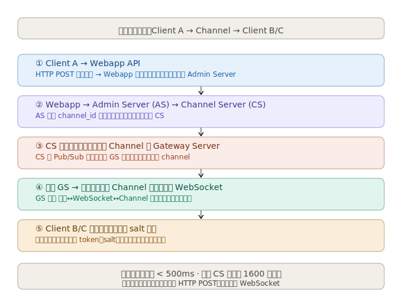

Slack 实时消息系统的关键设计围绕以下几个核心问题：
- 消息如何通过 WebSocket 在全球范围内 500ms 内到达用户
- 如何用一致性哈希管理数以千万计的 Channel
- Pub/Sub 如何在 Gateway Server 和 Channel Server 之间协调

先看整体架构流程：

接下来是消息从发送到接收的完整时序流程：

最后是核心设计决策总结：

---

以下是对这套系统设计的文字解读，供你在面试中系统化陈述：

**核心架构三层分离**

Slack 的后端由三类服务器组成。Channel Server（CS）是有状态的内存服务器，每台在峰值时服务约 1600 万个频道，通过一致性哈希将频道映射到具体节点。Gateway Server（GS）同样是有状态的内存服务器，负责维护用户信息和 WebSocket 订阅关系，是客户端与 CS 之间的接口。Admin Server（AS）是无状态的，作为 Webapp 和 CS 之间的路由中间层。

**消息发送路径的关键决策**

客户端通过 HTTP POST 发送消息到 Webapp，Webapp 先记录日志持久化并建立索引，然后再调用 Channel Server 进行实时广播。这种方式改善了崩溃安全性，并确保消息要么被存储，要么发送方收到明确的失败通知。移动端客户端也因此不需要建立持久 WebSocket 连接即可发送消息。

**WebSocket 连接建立流程**

客户端启动时，先从 Webapp 获取用户 token 和 WebSocket 连接配置，然后连接到最近的边缘节点，Envoy 将请求转发给 GS。GS 获取该用户所在的所有频道信息后，通过一致性哈希异步订阅对应的 CS。

**Flannel 解决启动延迟**

Slack 引入了 Flannel——一个地理分布式微服务，维护预热的内存团队元数据缓存，监听实时事件保持缓存更新，从区域副本本地提供会话数据，将会话启动从一个计算密集型操作转变为缓存驱动的过程。P99 延迟因此从 2000ms 降至 200ms。

**去重与消息顺序**

他们对消息进行 salt 处理以防止同一条消息展示两次——salt 是一个随机唯一 token。消息顺序则由 CS 在广播前全局定序，保证所有用户看到一致的对话历史。