以下是整张架构图的逐层说明。




**接入层** 浏览器、移动端、第三方 API 三类客户端统一进入系统，流量在进入后端之前全部汇聚到网关。

**网关层** 负载均衡器承担限流（Rate Limiting）、鉴权（JWT/API Key）和路由两项核心职责：写请求打到写入服务集群，读请求打到重定向服务集群，彻底物理隔离，互不影响。

**服务层** 写入服务负责创建/更新/删除短链；重定向服务只做一件事——查短码、返回 302。两个集群独立横向扩容。

**核心组件** 写路径先经过发号器（Raft 强一致）领取号段、Base62 编码；再经 Bloom Filter 做内存级去重预检，把绝大多数冲突拦在数据库之外。读路径先查 Redis 集群，命中直接返回；未命中才穿透到数据库，并回填缓存。

**消息队列** Kafka 作为写入路径的缓冲层，把 10M/s 的随机写变成顺序追加，削平突发峰值，同时将日志异步分发给下游分析系统。

**存储层** ScyllaDB（LSM-Tree 引擎）按 short_code 首字符哈希分片，每个分片独立扩容。数据库层仍保留唯一索引作为防重的最后一道防线。

**数据分层** 按数据年龄自动流转：0–7 天热数据留在 NVMe SSD，7–30 天温数据降到 HDD，30 天以上冷数据归档到对象存储，到期数据由定时任务清除，彻底解决磁盘增长问题。

**分析与监控** Kafka 旁路异步消费点击日志写入 ClickHouse 供统计分析；Prometheus + PagerDuty 做实时告警；磁盘使用率超过 70% 自动触发扩容，绝不等到填满。

---


# URL 缩短器设计

## 核心需求

**功能性需求：**
- 输入长 URL，生成短链接（如 `sho.rt/abc123`）
- 访问短链接时重定向到原始 URL
- 支持自定义短码（可选）
- 链接可设置过期时间

**非功能性需求：**
- 高可用（99.9%+）
- 低延迟重定向（< 10ms）
- 支持每秒 10万+ 读请求（读多写少，约 100:1）

---

## 容量估算

| 指标 | 数值 |
|------|------|
| 日新增短链 | 1 亿条 |
| 日重定向请求 | 100 亿次 |
| 短码长度 | 7位（62^7 ≈ 3500亿，足够用） |
| 存储（5年） | ~3 TB |

---

## 系统架构

```
用户
 │
 ├─── 写请求 ──→ [API 服务] ──→ [ID 生成器] ──→ [MySQL/主库]
 │
 └─── 读请求 ──→ [重定向服务] ──→ [Redis 缓存] ──→ [MySQL/从库]
                                      ↑
                                   热点链接缓存
```

**主要组件：**

- **API 服务**：处理创建、删除链接的写操作
- **重定向服务**：专门处理读操作，返回 301/302 跳转
- **ID 生成器**：生成唯一短码
- **Redis**：缓存热点 URL，TTL 与链接过期时间一致
- **MySQL**：持久化存储

---

## 核心数据库设计

```sql
CREATE TABLE url_mapping (
  id          BIGINT PRIMARY KEY,
  short_code  VARCHAR(8) UNIQUE NOT NULL,
  origin_url  TEXT NOT NULL,
  user_id     BIGINT,
  created_at  TIMESTAMP DEFAULT NOW(),
  expires_at  TIMESTAMP,
  click_count BIGINT DEFAULT 0
);

CREATE INDEX idx_short_code ON url_mapping(short_code);
```

---

## 短码生成策略

**方案一：Base62 编码（推荐）**

```
全局自增 ID → Base62 编码 → 7位短码
例：ID=12345678 → "5Fecj"
```

用 **发号器服务**（如 Snowflake ID）保证分布式唯一性，避免数据库单点瓶颈。

**方案二：哈希截断**

对原始 URL 做 MD5/SHA1，取前 7 位。简单但有碰撞风险，需要冲突检测。

---

## 重定向策略

| 状态码 | 场景 | 是否缓存 |
|--------|------|----------|
| 301 | 永久重定向 | 浏览器永久缓存，减少服务器压力 |
| 302 | 临时重定向 | 每次回源，便于统计点击数 |

**建议用 302**，以便准确统计点击量和支持链接更新。

---

## 缓存策略

```
读请求 → 查 Redis
   ├── 命中 → 直接返回（< 1ms）
   └── 未命中 → 查 MySQL → 写回 Redis（TTL = 24h）→ 返回
```

采用 **Cache-Aside** 模式，热点数据常驻缓存。缓存命中率预计 > 95%。

---

## 扩展性设计

**水平扩展：**
- API 服务与重定向服务无状态，可任意横向扩展
- MySQL 主从分离，读从库、写主库
- Redis 集群模式

**数据库分片：**  
按 `short_code` 哈希分片，分散写压力

**CDN 加速：**  
将 301 重定向结果推到 CDN 边缘节点，进一步降低全球访问延迟

---

## 其他考量

- **防滥用**：对同一 IP/用户的创建请求做频率限制（Rate Limiting）
- **黑名单**：过滤恶意/违规 URL
- **数据分析**：异步写入点击日志到 Kafka，供后续统计分析
- **过期清理**：定时任务删除过期链接，释放存储空间