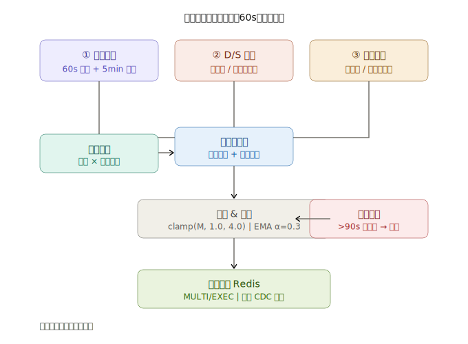

以下是系统的完整架构设计，涵盖数据流、定价引擎逻辑以及六边形网格的实时更新机制。


以上是整体数据流架构。接下来看定价引擎内部的计算逻辑。---



## 关键设计决策

**H3 六边形网格选型**：推荐使用 Uber 开源的 H3 库，分辨率选 Resolution 9（每格约 0.1 km²），在精度和计算量之间取得平衡。相邻格可做 k-ring 平滑，避免格间乘数突变造成用户绕路刷价。

**60 秒内必须完成的路径**：Kafka 消费 → Flink 窗口关闭 → 因子合并 → Redis 写入。这条链路的 P99 延迟必须控制在 500ms 以内，剩余时间留给 CDC 下发和客户端渲染。瓶颈通常在 Flink 窗口触发，建议用 processing time 而非 event time，否则乱序数据会延迟触发。

**乘数公式的实现细节**：
- D/S 比率要用指数函数而非线性函数：`α(x) = e^(k·(x-1))` 当 x>1 时快速上升，k 建议 0.4–0.6
- 历史权重用过去 4 周同时段中位数，避免节假日异常值污染
- EMA 平滑（α=0.3）防止乘数在短时间内剧烈震荡

**陈旧降级策略**：任何数据源超过 90 秒未更新，对应格子降级为安全乘数（1.0–1.2），同时触发告警。外部 API（天气/活动）中断时，使用前一有效值最多保留 10 分钟。

**Redis 存储格式**：
```
hex:{resolution}:{h3_index}  →  {multiplier, updated_at, expires_at, factors}
```
TTL 设为 75 秒（比更新周期多 25% 容错），确保客户端读到过期值时能正确触发回源。


时序数据库存的数据分两大类：**实时产生的运营数据**和**用于历史权重计算的基准数据**。---



两张核心表承担不同职责：

`hex_multiplier_history` 是**流水账**，每次定价引擎计算完就写入一条。记录的不只是最终乘数，还包括当时的 D/S 原始值和各因子——这样事后可以还原"乘数为什么在那个时间点涨到了 2.8"，对审计和模型调优都非常重要。

`hex_demand_baseline` 是**统计摘要**，由每日批处理任务从历史流水中聚合而来。它存的是"周三下午 6 点这个六边形的中位需求是多少"，专门供定价引擎在实时计算时快速查历史权重，不需要每次都扫描原始流水。

**关于保留策略的几个权衡点：**

原始 60 秒粒度只保留 7 天，主要因为每个六边形每天产生 1440 条记录，城市规模动辄几万个格子，数据量线性膨胀很快。7 天内可以做事故复盘，更长的分析用降采样数据足够。

降采样时用均值而非直接丢弃，这个细节很重要——历史权重计算需要的是"过去同时段的典型水平"，均值比最新单点更稳健，能过滤掉因演唱会、暴雨等偶发事件导致的异常乘数。

写入用 UDP 而非 TCP 的原因是不能让数据库写入阻塞定价主链路——即使偶尔丢几条记录，对历史统计影响可忽略，但阻塞主流程会让乘数更新延迟超过 60 秒的 SLA。