以下是每分钟 100 万请求（约 **16,667 RPS**）的架构设计思路和具体节点数量估算：---

## 各层节点数量与计算依据

**Nginx 接入层 — 3 台**

每台 Nginx 可以轻松处理 5,000–10,000 RPS（开启 keepalive + epoll 后可达 30,000+ RPS）。16,667 RPS 理论上 2 台即可，配置 3 台实现 Active-Active-Standby，任意 1 台宕机不影响服务。

**API Gateway — 3 台**

Kong/APISIX 单节点 QPS 约 5,000–8,000（带认证、限流插件时）。3 台可覆盖峰值并预留容量，同时做插件处理（JWT 验签、Rate Limit、路由）。

**Spring Boot 微服务 — 共约 38 个实例**

按业务域拆分，单实例以 200–300 RPS 保守估算（有 IO 等待、数据库调用），各服务数量如下：

| 服务 | 实例数 | 说明 |
|---|---|---|
| 用户服务 | 6 | 登录/鉴权频繁 |
| 订单服务 | 8 | 写入压力最大 |
| 商品服务 | 6 | 读多写少，可配合缓存 |
| 支付服务 | 6 | 强一致性，适当保守 |
| 推荐服务 | 4 | 异步为主 |
| 通知服务 | 4 | 削峰后压力小 |
| 搜索服务 | 4 | 依赖 ES，实例轻量 |

**Redis 缓存 — 9 台**

采用 Redis Cluster 3 主 6 从（每个主节点 2 个从副本）。Redis 单节点可达 10 万 QPS，9 台集群远超需求，主要目的是**高可用**而非扩容。热点数据命中率目标 > 90%，可将后端 DB 压力降低 10 倍。

**数据库 — 6 台**

2 台主库（按业务垂直分库，如用户库、订单库），4 台从库做读写分离。真正到达数据库的写请求经 Redis 拦截后约 1,500–2,000 RPS，完全可控。如果单表数据量大，再叠加 ShardingSphere 做水平分库分表。

---

## 关键设计原则

**CDN 前置**：静态资源和热点接口响应直接从边缘节点返回，能拦截 30–50% 的流量根本不打到源站。

**消息队列削峰**：订单创建、通知发送等非实时业务走 Kafka 异步化，把瞬时洪峰"拉平"为平稳的消费速率。

**缓存优先**：Redis 承接 90%+ 的读请求，数据库只处理缓存 miss 和写操作。

**水平扩展**：微服务实例数可根据实时 QPS 通过 Kubernetes HPA 动态伸缩，以上数字是**基准配置**，高峰期可弹性扩至 2 倍。

点击图中任意节点可以深入了解该组件的配置细节。