这是一个经典的**热点 URL（Hot Key）问题**，也是短链系统最难处理的故障场景。让我先画架构图，然后分层分析。核心问题是：**正常流量 1 万 QPS 均匀分散在海量 URL 上，而现在 10 万 QPS 打在同一个 URL 上**。两者量级相差不大，但热点 key 的集中程度完全不同，会在每一层都产生瓶颈。

---

## 分层击穿分析与对策

**第一层：CDN 边缘（最重要的防线）**

短链重定向本质上是 `GET /abc123 → 302 Location: https://...`，这个响应完全可以被 CDN 缓存。**301（永久重定向）会被浏览器缓存**，下次直接不走网络；**302（临时重定向）只在 CDN 侧缓存**，浏览器每次还是会请求。

对于已知热点 URL，优先下发 `Cache-Control: public, max-age=3600`。理想状态下 CDN 边缘节点直接消化 90%+ 流量，根本不需要回源。

**第二层：应用节点本地缓存（L1）**

即使有 CDN，仍有 miss 流量回源。这时每个应用节点都应该有 JVM 堆内缓存（Caffeine），容量很小（几千个 key），但对于这种 10 万 QPS 打一个 URL 的场景，该 key 会稳定地热在本地缓存里，**每次命中是一次 HashMap 查找，完全没有网络 IO**。

关键设计：使用**一致性哈希**路由，让同一个 short code 的请求尽量落在同一批节点，提升 L1 命中率。

**第三层：Redis 热点 key 问题**

单个 Redis 节点的网络带宽约 100MB/s，极端热点会打满单节点。解决方案是**热点 key 多副本复制**：检测到某 key QPS 超阈值后，将其复制为 `url:abc123:0`、`url:abc123:1`... `url:abc123:N`，读取时随机选副本，写入时广播。这样 10 万 QPS 被散列到多个 Redis 节点上。

**第四层：MySQL 不能成为写入瓶颈**

点击统计绝对不能同步写 DB。每次重定向 `UPDATE clicks = clicks + 1` 在 10 万 QPS 下会直接击垮数据库。必须用 **Kafka 异步消费**，Consumer 端做时间窗口内的批量聚合（比如每 5 秒合并一次），再一次性写入 MySQL。UV 去重用 Redis HyperLogLog，误差率 0.81% 完全可接受。

---

## 热点检测与自动预热

这是整个方案里最精髓的部分。系统需要**提前感知热点**，而不是被动响应缓存 miss。

实现思路：每台应用节点用**滑动窗口 + 小顶堆**在内存里维护实时 TopK。当某 URL 的 QPS 在 10 秒内超过阈值（比如 5000），发送事件到热点检测服务，由它触发：
1. 主动将该 URL 推送到所有应用节点的 L1 缓存（而不是等缓存自然命中）
2. 在 Redis 里创建多副本
3. 给 CDN 下发预热指令，主动 push 到边缘节点

名人发推到流量洪峰之间通常有几十秒的延迟，这个时间窗口足够完成预热。

---

## 301 vs 302 的权衡

这是一个有意思的产品决策。302 意味着每次都经过你的服务器，你能实时统计点击、A/B 测试、随时修改目标 URL；301 意味着浏览器缓存后你永久失去这条流量的感知。对于商业短链（bitly 等），一般选 302 + CDN 层缓存，兼顾可控性和性能。

---

总结来看，这道题的核心不是单点技术，而是**多级缓存的协同设计**——CDN 在边缘拦截大头，L1 本地缓存处理回源流量，Redis 多副本处理缓存 miss，写入全部异步化。每一层都有自己的容量上限，组合起来才能应对这种量级的单点热点。

> 可以点击图中任意节点，我来深入展开某个具体模块的实现细节。