下面是 Java 线上问题排查的完整流程图，涵盖四大场景。下面是四大场景的完整排查步骤与核心命令。


---

## CPU 100%

**排查步骤：**

1. `top` 找到 CPU 占用最高的 Java 进程 PID
2. `top -Hp <pid>` 查看进程内各线程 CPU 占比，找到最高的 TID
3. `printf "%x\n" <tid>` 将 TID 转成十六进制 nid
4. `jstack <pid> | grep -A 30 <0xnid>` 找到该线程的调用栈
5. 分析栈帧——常见根因：死循环、GC 频繁、正则回溯、线程池满载

---

## OOM (OutOfMemoryError)

**JVM 参数（提前加好）：**
```
-XX:+HeapDumpOnOutOfMemoryError
-XX:HeapDumpPath=/logs/heapdump.hprof
```

**已发生时手动 dump：**
```bash
jmap -dump:live,format=b,file=heap.hprof <pid>
```

**分析工具：** Eclipse MAT 或 VisualVM，查看 Dominator Tree 找最大保留对象

| OOM 类型 | 关键词 | 处置 |
|---|---|---|
| Java heap space | 对象太多 / 内存泄漏 | 扩 `-Xmx`，修复泄漏 |
| Metaspace | 类加载失控 | 查动态代理、热部署、classLoader |
| Direct buffer memory | NIO 堆外内存 | 加 `-XX:MaxDirectMemorySize` |
| unable to create new native thread | 线程数超限 | 减小线程栈 `-Xss`，降并发 |

---

## 死锁 (Deadlock)

**一键检测：**
```bash
jstack <pid> | grep -A 30 "deadlock"
```

jstack 会在末尾自动输出 `Found 1 deadlock.`，并列出互相等待的线程与锁地址。

**修复原则：**
- 多个锁按**固定顺序**获取，消除"持有并等待"
- 使用 `ReentrantLock.tryLock(timeout)` 带超时获取，失败时回退
- 尽量减小锁粒度，避免嵌套锁

---

## 死循环 (Infinite Loop)

**与 CPU 高排查相同，关键是"多次抓栈对比"：**

```bash
jstack <pid> > stack1.txt && sleep 3 && jstack <pid> > stack2.txt
diff stack1.txt stack2.txt
```

死循环线程的栈帧在两次 dump 中**几乎完全相同**且状态为 `RUNNABLE`，据此精确定位代码行。

**常见陷阱：**
- JDK 7 `HashMap` 并发 `put` 导致链表成环（JDK 8 改为尾插法，但并发仍不安全，改用 `ConcurrentHashMap`）
- `while(true)` 内退出条件逻辑错误，或依赖某变量却未加 `volatile`

---

## Arthas 一站式诊断

阿里开源的 Arthas 可以免重启在线诊断，常用命令：

```bash
dashboard          # 实时查看线程、内存、GC
thread -n 3        # 列出 CPU 最高的 3 个线程及其栈
trace com.X method # 方法调用耗时追踪
watch com.X method "{params,returnObj}" -x 3  # 观察入参/返回值
heapdump /tmp/h.hprof  # 在线 dump 堆
```