这是一个很好的工程题目。我来设计一个高性能、可靠的本地持久化队列，核心思路是 **内存队列 + WAL (Write-Ahead Log) 持久化 + MappedByteBuffer 零拷贝**。

先来看整体架构：下面是完整的实现代码：


---

## 核心接口

```java
public interface PersistentQueue<T> extends Closeable {
    void offer(T item) throws InterruptedException;
    T poll(long timeout, TimeUnit unit) throws InterruptedException;
    T take() throws InterruptedException;
    void ack(long offset) throws IOException;   // 消费确认，推进 checkpoint
    int size();
}
```

---

## 消息格式与 Segment 文件

```java
/**
 * WAL 消息格式（每条记录）:
 * [4B magic][8B offset][4B length][NB payload][4B crc32]
 */
public final class WalRecord {
    static final int MAGIC   = 0xCAFEBABE;
    static final int HEADER  = 4 + 8 + 4;  // magic + offset + length
    static final int TRAILER = 4;           // crc32

    public final long   offset;
    public final byte[] payload;

    public WalRecord(long offset, byte[] payload) {
        this.offset  = offset;
        this.payload = payload;
    }

    public static int serializedSize(byte[] payload) {
        return HEADER + payload.length + TRAILER;
    }
}
```

```java
/**
 * 单个 Segment 文件，通过 MappedByteBuffer 做零拷贝写入。
 * 文件名: seg-{baseOffset:020d}.data
 */
public class Segment implements Closeable {

    static final int  DEFAULT_SIZE = 64 * 1024 * 1024; // 64 MB

    private final Path             path;
    private final long             baseOffset;
    private final RandomAccessFile raf;
    private final FileChannel      channel;
    private final MappedByteBuffer mmap;
    private final AtomicInteger    writePos  = new AtomicInteger(0);
    private volatile boolean       immutable = false;  // 滚动后设为只读

    public Segment(Path dir, long baseOffset, int maxSize) throws IOException {
        this.baseOffset = baseOffset;
        this.path       = dir.resolve(String.format("seg-%020d.data", baseOffset));
        this.raf        = new RandomAccessFile(path.toFile(), "rw");
        raf.setLength(maxSize);
        this.channel = raf.getChannel();
        this.mmap    = channel.map(FileChannel.MapMode.READ_WRITE, 0, maxSize);
        this.mmap.order(ByteOrder.BIG_ENDIAN);
    }

    /**
     * 追加写入，返回写入的全局 offset（baseOffset + 文件内位置）。
     * 线程安全：多个写线程用 CAS 竞争 writePos。
     */
    public long append(byte[] payload) throws IOException {
        if (immutable) throw new IllegalStateException("Segment is immutable");
        int  size  = WalRecord.serializedSize(payload);
        int  pos   = reserveSpace(size);
        if  (pos < 0) return -1;  // 段已满

        long globalOffset = baseOffset + pos;
        CRC32 crc = new CRC32();
        crc.update(payload);

        // 直接写 mmap，无需 System call
        MappedByteBuffer slice = (MappedByteBuffer) mmap.duplicate();
        slice.position(pos);
        slice.putInt(WalRecord.MAGIC);
        slice.putLong(globalOffset);
        slice.putInt(payload.length);
        slice.put(payload);
        slice.putInt((int) crc.getValue());
        return globalOffset;
    }

    /** 强制刷盘（fsync 语义）。*/
    public void force() { mmap.force(); }

    /** 迭代读取，从 fromPos 开始，跳过 offset < minOffset 的记录。 */
    public List<WalRecord> readFrom(int fromPos, long minOffset) {
        List<WalRecord> result = new ArrayList<>();
        ByteBuffer buf = mmap.asReadOnlyBuffer().order(ByteOrder.BIG_ENDIAN);
        buf.position(fromPos);
        int limit = writePos.get();
        while (buf.position() < limit) {
            int start = buf.position();
            if (buf.remaining() < WalRecord.HEADER) break;
            int magic = buf.getInt();
            if (magic != WalRecord.MAGIC) break;
            long off  = buf.getLong();
            int  len  = buf.getInt();
            if (buf.remaining() < len + WalRecord.TRAILER) break;
            byte[] payload = new byte[len];
            buf.get(payload);
            int storedCrc = buf.getInt();
            CRC32 crc = new CRC32();
            crc.update(payload);
            if ((int) crc.getValue() != storedCrc) break; // 数据损坏，停止
            if (off >= minOffset) result.add(new WalRecord(off, payload));
        }
        return result;
    }

    public void seal() { this.immutable = true; }

    public boolean isFull(int recordSize) {
        return writePos.get() + recordSize > mmap.capacity();
    }

    public long baseOffset() { return baseOffset; }
    public Path path()       { return path; }

    private int reserveSpace(int size) {
        while (true) {
            int cur = writePos.get();
            if (cur + size > mmap.capacity()) return -1;
            if (writePos.compareAndSet(cur, cur + size)) return cur;
        }
    }

    @Override public void close() throws IOException {
        mmap.force();
        channel.close();
        raf.close();
    }
}
```

---

## Checkpoint — 消费位点持久化

```java
/**
 * 原子写入 checkpoint 文件，防止半写导致位点损坏。
 * 格式: {8B offset}{4B crc32}
 */
public class Checkpoint implements Closeable {

    private static final int FILE_SIZE = 12;

    private final MappedByteBuffer mmap;
    private final FileChannel      channel;
    private final RandomAccessFile raf;
    private final AtomicLong       confirmedOffset = new AtomicLong(-1L);

    public Checkpoint(Path path) throws IOException {
        this.raf     = new RandomAccessFile(path.toFile(), "rw");
        raf.setLength(FILE_SIZE);
        this.channel = raf.getChannel();
        this.mmap    = channel.map(FileChannel.MapMode.READ_WRITE, 0, FILE_SIZE);
        this.mmap.order(ByteOrder.BIG_ENDIAN);
        // 启动时读取已持久化的位点
        long saved = readSafe();
        confirmedOffset.set(saved);
    }

    public void advance(long offset) throws IOException {
        if (offset <= confirmedOffset.get()) return;
        confirmedOffset.set(offset);
        persist(offset);
    }

    public long get() { return confirmedOffset.get(); }

    private void persist(long offset) throws IOException {
        CRC32 crc = new CRC32();
        ByteBuffer tmp = ByteBuffer.allocate(8).order(ByteOrder.BIG_ENDIAN);
        tmp.putLong(offset);
        crc.update(tmp.array());
        mmap.position(0);
        mmap.putLong(offset);
        mmap.putInt((int) crc.getValue());
        mmap.force();
    }

    private long readSafe() {
        if (mmap.capacity() < FILE_SIZE) return -1L;
        mmap.position(0);
        long offset = mmap.getLong();
        int  stored = mmap.getInt();
        CRC32 crc = new CRC32();
        ByteBuffer tmp = ByteBuffer.allocate(8).order(ByteOrder.BIG_ENDIAN);
        tmp.putLong(offset);
        crc.update(tmp.array());
        return (int) crc.getValue() == stored ? offset : -1L;
    }

    @Override public void close() throws IOException {
        channel.close(); raf.close();
    }
}
```

---

## 核心实现：LocalPersistentQueue

```java
public class LocalPersistentQueue<T> implements PersistentQueue<T>, Closeable {

    private final Path                    dataDir;
    private final Serializer<T>           serializer;
    private final int                     segmentSize;
    private final int                     memCapacity;

    // 写侧
    private final ReentrantLock           writeLock    = new ReentrantLock();
    private final CopyOnWriteArrayList<Segment> segments = new CopyOnWriteArrayList<>();
    private volatile Segment              activeSegment;
    private final AtomicLong              nextOffset   = new AtomicLong(0L);

    // 读侧
    private final BlockingQueue<QueueEntry<T>> memQueue;
    private final Checkpoint              checkpoint;

    // 后台 GC
    private final ScheduledExecutorService gcExecutor;

    public LocalPersistentQueue(Path dataDir, Serializer<T> serializer,
                                int segmentSize, int memCapacity) throws IOException {
        this.dataDir     = dataDir;
        this.serializer  = serializer;
        this.segmentSize = segmentSize;
        this.memCapacity = memCapacity;
        Files.createDirectories(dataDir);
        this.memQueue   = new ArrayBlockingQueue<>(memCapacity);
        this.checkpoint = new Checkpoint(dataDir.resolve("checkpoint"));
        recover();  // 启动恢复
        this.gcExecutor = Executors.newSingleThreadScheduledExecutor(
            r -> { Thread t = new Thread(r, "pq-gc"); t.setDaemon(true); return t; });
        gcExecutor.scheduleWithFixedDelay(this::gcSegments, 30, 30, TimeUnit.SECONDS);
    }

    @Override
    public void offer(T item) throws InterruptedException {
        byte[] payload = serializer.serialize(item);
        writeLock.lock();
        try {
            ensureActiveSegment(payload.length);
            long offset = activeSegment.append(payload);
            // 同步刷盘（可调整为异步批量 fsync 以提升吞吐）
            activeSegment.force();
            // 写入内存队列（back pressure：若满则阻塞）
            memQueue.put(new QueueEntry<>(offset, item));
        } catch (IOException e) {
            throw new RuntimeException("WAL write failed", e);
        } finally {
            writeLock.unlock();
        }
    }

    @Override
    public T poll(long timeout, TimeUnit unit) throws InterruptedException {
        QueueEntry<T> entry = memQueue.poll(timeout, unit);
        return entry != null ? entry.value : null;
    }

    @Override
    public T take() throws InterruptedException {
        return memQueue.take().value;
    }

    @Override
    public void ack(long offset) throws IOException {
        checkpoint.advance(offset);
    }

    /** 启动恢复：从 checkpoint 位点之后重放 WAL，补充内存队列。 */
    private void recover() throws IOException {
        long minOffset = checkpoint.get() + 1;
        List<Path> segPaths = listSegmentPaths();
        for (Path p : segPaths) {
            long base = parseBaseOffset(p);
            Segment seg = new Segment(dataDir, base, segmentSize);
            segments.add(seg);
            List<WalRecord> records = seg.readFrom(0, minOffset);
            for (WalRecord r : records) {
                T item = serializer.deserialize(r.payload);
                // 恢复时不阻塞，直接 offer（内存队列容量需 >= 未消费记录数）
                memQueue.offer(new QueueEntry<>(r.offset, item));
            }
        }
        if (segments.isEmpty()) {
            activeSegment = new Segment(dataDir, 0L, segmentSize);
            segments.add(activeSegment);
        } else {
            activeSegment = segments.get(segments.size() - 1);
        }
        nextOffset.set(activeSegment.baseOffset() + segmentSize); // 粗估，实际由 append 推进
    }

    /** 滚动新段。调用方持有 writeLock。*/
    private void ensureActiveSegment(int payloadSize) throws IOException {
        int needed = WalRecord.serializedSize(new byte[payloadSize]);
        if (activeSegment.isFull(needed)) {
            activeSegment.seal();
            long newBase = nextOffset.get();
            activeSegment = new Segment(dataDir, newBase, segmentSize);
            segments.add(activeSegment);
        }
    }

    /** 后台 GC：删除所有消息均已消费的段。*/
    private void gcSegments() {
        long confirmed = checkpoint.get();
        segments.removeIf(seg -> {
            long segEnd = seg.baseOffset() + segmentSize;
            if (seg == activeSegment) return false;  // 当前写段不删
            if (segEnd <= confirmed) {
                try { seg.close(); Files.deleteIfExists(seg.path()); return true; }
                catch (IOException e) { /* log */ return false; }
            }
            return false;
        });
    }

    private List<Path> listSegmentPaths() throws IOException {
        try (var s = Files.list(dataDir)) {
            return s.filter(p -> p.getFileName().toString().startsWith("seg-"))
                    .sorted()
                    .collect(Collectors.toList());
        }
    }

    private long parseBaseOffset(Path p) {
        String name = p.getFileName().toString();
        return Long.parseLong(name.replace("seg-", "").replace(".data", ""));
    }

    @Override
    public int size() { return memQueue.size(); }

    @Override
    public void close() throws IOException {
        gcExecutor.shutdown();
        for (Segment seg : segments) seg.close();
        checkpoint.close();
    }

    // 内部封装条目
    record QueueEntry<T>(long offset, T value) {}

    // 序列化接口
    public interface Serializer<T> {
        byte[] serialize(T item);
        T      deserialize(byte[] bytes);
    }
}
```

---

## 使用示例

```java
// 初始化（使用 JSON 序列化示意）
LocalPersistentQueue<String> queue = new LocalPersistentQueue<>(
    Path.of("/data/queue"),
    new LocalPersistentQueue.Serializer<>() {
        public byte[] serialize(String s)    { return s.getBytes(UTF_8); }
        public String deserialize(byte[] b)  { return new String(b, UTF_8); }
    },
    64 * 1024 * 1024,  // 64 MB per segment
    10_000             // 内存最多缓存 10000 条
);

// 生产
queue.offer("hello");

// 消费（at-least-once）
String msg = queue.take();
process(msg);
queue.ack(offset);   // 消费成功后推进 checkpoint
```

---

## 关键设计决策总结

| 维度 | 方案 | 原因 |
|---|---|---|
| 持久化 | MappedByteBuffer + force() | 零拷贝，避免 write syscall 开销 |
| 写入顺序 | append-only 顺序写 | HDD/SSD 顺序写远快于随机写 |
| 可靠性 | magic + CRC32 per record | 崩溃后能检测并截断损坏尾部 |
| 恢复 | 从 checkpoint 位点重放 WAL | 仅重放未确认消息，O(未消费量) |
| 内存回压 | ArrayBlockingQueue 有界 | 防止 OOM，自然形成 back pressure |
| GC | 后台定期扫描已消费段 | 不阻塞写路径 |
| 线程安全 | writeLock + AtomicLong | 写单锁简化段滚动逻辑 |

> **进一步优化方向**：批量 fsync（攒够 N 条或超时后刷盘，显著提升吞吐）；多消费者组（每个 group 独立 checkpoint）；直接 IO 绕过 page cache（`O_DIRECT`，需 JNI）。