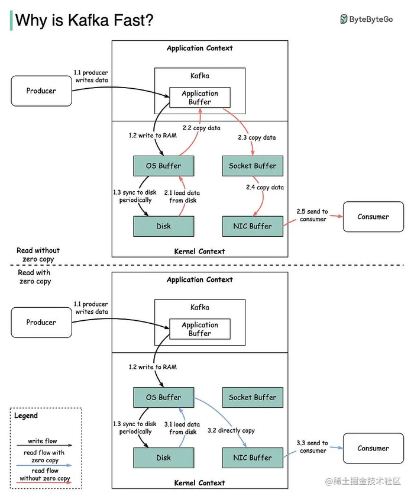

# Kafka为什么这么快？

Kafka 是一个基于发布-订阅模式的消息系统，它可以在多个生产者和消费者之间传递大量的数据。Kafka 的一个显著特点是它的高吞吐率，即每秒可以处理百万级别的消息。那么 Kafka 是如何实现这样高得性能呢？本文将从七个方面来分析 Kafka 的速度优势。

- 零拷贝技术
- 仅可追加日志结构
- 消息批处理
- 消息批量压缩
- 消费者优化
- 未刷新的缓冲写入
- GC 优化

以下是对本文中使用得一些英文单词得解释：

- **Broker**：Kafka 集群中的一台或多台服务器统称 broker
- **Producer**：消息生产者
- **Consumer**：消息消费者
- **zero copy**：零拷贝

## 1. 零拷贝技术

零拷贝技术是指在读写数据时，避免将数据在内核空间和用户空间之间进行拷贝，而是直接在内核空间进行数据传输。对于 Kafka 来说，它使用了零拷贝技术来加速磁盘文件的网络传输，以提高读取速度和降低 CPU 消耗。下图说明了数据如何在生产者和消费者之间传输，以及零拷贝原理。

- **步骤 1.1~1.3**：生产者将数据写入磁盘
- **步骤 2：消费者不使用零拷贝方式读取数据**
    - 2.1：数据从磁盘加载到 OS 缓存
    - 2.2：将数据从 OS 缓存复制到 Kafka 应用程序
    - 2.3：Kafka 应用程序将数据复制到 socket 缓冲区
    - 2.4：将数据从 socket 缓冲区复制到网卡
    - 2.5：网卡将数据发送给消费者
- **步骤 3：消费者以零拷贝方式读取数据**
    - 3.1：数据从磁盘加载到 OS 缓存
    - 3.2：OS 缓存通过 sendfile() 命令直接将数据复制到网卡
    - 3.3：网卡将数据发送到消费者

可以看到，零拷贝技术避免了多余得两步操作，数据直接从 OS 缓存复制到网卡再到消费者。这样做的好处是极大地提高了 I/O 效率，降低了 CPU 和内存的消耗。

## 2. 仅可追加日志结构

Kafka 中存在大量的网络数据持久化到磁盘（生产者到代理）和磁盘文件通过网络发送（代理到消费者）的过程。这一过程的性能会直接影响 Kafka 的整体吞吐量。为了优化 Kafka 的数据存储和传输，Kafka 采用了一种仅可追加日志结构方式来持久化数据。仅可追加日志结构是指将数据以顺序追加（append-only）的方式写入到文件中，而不是进行随机写入或更新。这样做的好处是可以减少磁盘 I/O 的开销，提高写入速度。

人们普遍认为磁盘的读写速度很慢，但实际上存储介质（尤其是旋转介质）的性能很大程度上取决于访问模式。常见的 7,200 RPM SATA 磁盘上的随机 I / O 的性能要比顺序 I / O 慢 3 ～ 4 个数量级。此外，现代操作系统提供了预读和延迟写入技术，可以预先取出大块的数据，并将较小的逻辑写入组合成较大的物理写入。因此，即使在闪存和其他形式的固态非易失性介质中，随机 I/O 和顺序 I/O 的差异仍然很明显，尽管与旋转介质相比，这种差异性已经很小了。

## 3. 消息批处理

Kafka 的高吞吐率设计的核心要点之一是批处理，即 Kafka 在消息发送端和接收端都引入了一个缓冲区，将多条消息打包成一个批次（Batch），然后一次性发送或接收。这样做的好处是可以减少网络请求的次数，减少了网络压力，提高了传输效率。

Kafka 的消息批处理优化主要涉及以下几个方面：

### 发送端（Producer）

Kafka 的 Producer 只提供了单条发送的 send()方法，并没有提供任何批量发送的接口。当调用 send()方法发送一条消息之后，无论是同步还是异步发送，这条消息不会立即发送出去，而是先放入到一个双端队列中，然后 Kafka 使用一个异步线程从队列中成批发送消息。

Kafka 提供了以下几个参数来控制发送端的批处理策略：

- **batch.size**：指定每个批次可以收集的消息数量的最大值。默认是 16KB。
- **buffer.memory**：指定每个 Producer 可以使用的缓冲区内存的总量。默认是 32MB。
- **linger.ms**：指定每个批次可以等待的时间的最大值。默认是 0ms。
- **compression.type**：指定是否对每个批次进行压缩，以及使用哪种压缩算法。默认是 none。

### 接收端（Broker）

Kafka 的 Broker 在接收到 Producer 发送过来的批次后，不会把批次再还原成多条消息，而是直接将整个批次写入到磁盘中。这样做的好处是可以减少磁盘 I/O 的开销，提高写入速度。

Kafka 利用了操作系统提供的内存映射文件（memory mapped file）功能，将文件映射到内存中，使得对文件的读写操作就相当于对内存的读写操作。这样就避免了用户空间和内核空间之间的数据拷贝，也避免了系统调用的开销。

### 消费端（Consumer）

Kafka 的 Consumer 在从 Broker 拉取数据时，也是以批次为单位进行传递的。Consumer 从 Broker 拉到一批消息后，客户端把批次解开，再一条一条交给用户代码处理。

Kafka 提供了以下几个参数来控制消费端的批处理策略：

- **fetch.min.bytes**：指定每次拉取请求至少要获取多少字节的数据。默认是 1B。
- **fetch.max.bytes**：指定每次拉取请求最多能获取多少字节的数据。默认是 50MB。
- **fetch.max.wait.ms**：指定每次拉取请求最多能等待多长时间。默认是 500ms。
- **max.partition.fetch.bytes**：指定每个分区每次拉取请求最多能获取多少字节的数据。默认是 1MB。

## 4. 消息批量压缩

消息批量压缩通常与消息批处理一起使用。Kafka 会将多个消息打包成一个批次（Batch），并对批次进行压缩（例如使用 gzip 或 snappy 算法），然后再发送给消费者。这样做的好处是可以节省网络带宽，提高传输效率。

当然，压缩也有一定的代价，即需要消耗 CPU 资源来进行压缩和解压缩。但是对于 Kafka 这样的高吞吐量的系统来说，网络带宽往往是更大的瓶颈，所以压缩是值得的。

Kafka 还提供了一种灵活的压缩策略，即可以让生产者、代理和消费者之间协商压缩格式和级别。生产者可以选择是否对消息进行压缩，以及使用哪种压缩算法；代理可以选择是否保留生产者压缩的消息，或者对其进行重新压缩；消费者可以选择是否对收到的消息进行解压缩。这样可以根据不同的场景和需求来平衡性能和资源的消耗。

## 5. 消费者优化

Kafka 的消费者是基于拉模式（pull）的，即消费者主动向服务器请求数据，而不是服务器主动推送数据给消费者。这样做的好处是可以让消费者自己控制消费的速度和时机，也可以减轻服务器的负担，提高整体的吞吐量。

Kafka 的消费者所实现的功能是比较简洁的，即它们不需要维护太多的状态和资源，也不需要和服务器进行复杂的交互。Kafka 的消费者只需要做以下几件事：

1. 订阅一个或多个主题（topic），并加入一个消费者组（consumer group）。
2. 向群组协调器（group coordinator）发送心跳，表明自己还活着，并参与分区再均衡（partition rebalance）。
3. 向分区所在的代理（broker）发送拉取请求（fetch request），获取消息数据。
4. 提交自己消费到的偏移量（offset），以便在出现故障时恢复消费位置。

可以看到，Kafka 的消费者并不需要保存消息数据，也不需要对消息进行确认或回复，也不需要处理重试或重复的问题。这些都由服务器端来负责。Kafka 的消费者只需要关注如何从服务器获取数据，并进行业务处理即可。

## 6. 未刷新的缓冲写入

Kafka 在写入数据时，使用了一种未刷新（flush）的缓冲写入技术，即它不会立即将数据写入硬盘，而是先写入内存缓存中，然后由操作系统在适当的时候刷新到硬盘上。这样做的好处是可以提高写入速度，减少磁盘 I/O 的开销。

Kafka 利用了操作系统提供的内存映射文件（memory mapped file）功能，将文件映射到内存中，使得对文件的读写操作就相当于对内存的读写操作。这样就避免了用户空间和内核空间之间的数据拷贝，也避免了系统调用的开销。

当生产者向 Kafka 发送消息时，Kafka 会将消息追加到内存映射文件中，并返回一个确认给生产者。此时消息并没有真正写入硬盘，而是由操作系统负责将内存中的数据刷新到硬盘上。操作系统会根据一些策略来决定何时刷新数据，例如定期刷新、缓存满了刷新、系统空闲时刷新等。

当然，这种技术也有一定的风险，即如果操作系统在刷新数据之前发生崩溃或断电，那么内存中未刷新的数据就会丢失。为了解决这个问题，Kafka 提供了一些参数来控制刷新策略，例如：

- **log.flush.interval.messages**：指定多少条消息后强制刷新数据。
- **log.flush.interval.ms**：指定多少毫秒后强制刷新数据。
- **producer.type**：指定生产者是同步还是异步模式。同步模式下，生产者会等待服务器刷新数据后再返回确认；异步模式下，生产者不会等待服务器刷新数据，而是立即返回确认。

## 7. GC 优化

Kafka 作为一个 Java 编写得高性能的分布式消息系统，它需要处理大量的数据读写和网络传输。这些操作都会涉及到 Java 虚拟机（JVM）的内存管理和垃圾回收（GC）机制。如果 GC 不合理或不及时，就会导致 Kafka 的性能下降，甚至出现内存溢出或频繁的停顿。为了帮助使用者优化 GC，Kakfa 有如下建议。

### 堆内存大小

堆内存是 JVM 用来存储对象实例的内存区域，它会受到 GC 的管理和回收。堆内存的大小会影响 Kafka 的性能和稳定性，如果堆内存太小，就会导致频繁的 GC，影响吞吐量和延迟；如果堆内存太大，就会导致 GC 时间过长，影响响应速度和可用性。

通常来说，Kafka 并不需要设置太大的堆内存，因为它主要依赖于操作系统的文件缓存（page cache）来缓存和读写数据，而不是将数据保存在堆内存中。因此 Kafka 建议将堆内存大小设置为 4GB 到 6GB 之间。

### 堆外内存大小

堆外内存是 JVM 用来存储非对象实例的内存区域，它不会受到 GC 的管理和回收。堆外内存主要用于网络 I/O 缓冲区、直接内存映射文件、压缩库等。

Kafka 在进行网络 I/O 时，会使用堆外内存作为缓冲区，以减少数据在用户空间和内核空间之间的拷贝。同时，Kafka 在进行数据压缩时，也会使用堆外内存作为临时空间，以减少 CPU 资源的消耗。

因此，堆外内存对于 Kafka 的性能也很重要，如果堆外内存不足，就会导致缓冲区分配失败或压缩失败，影响吞吐量和延迟。通常来说，Kafka 建议将堆外内存大小设置为 8GB 左右。

### GC 算法和参数

GC 算法是 JVM 用来回收无用对象占用的堆内存空间的方法，它会影响 Kafka 的停顿时间和吞吐量。GC 算法有多种选择，例如串行 GC、并行 GC、CMS GC、G1 GC 等。

不同的 GC 算法有不同的优缺点和适用场景，例如串行 GC 适合小型应用和低延迟场景；并行 GC 适合大型应用和高吞吐量场景；CMS GC 适合大型应用和低停顿时间场景；G1 GC 适合大型应用和平衡停顿时间和吞吐量场景等。

通常来说，Kafka 建议使用 G1 GC 作为默认的 GC 算法，因为它可以在保证较高吞吐量的同时，控制停顿时间在 200ms 以内。同时，Kafka 还建议根据具体情况调整一些 GC 参数，例如：

- `-XX:MaxGCPauseMillis`：指定最大停顿时间目标，默认是 200ms。
- `-XX:InitiatingHeapOccupancyPercent`：指定触发并发标记周期的堆占用百分比，默认是 45%。
- `-XX:G1ReservePercent`：指定为拷贝存活对象预留的空间百分比，默认是 10%。
- `-XX:G1HeapRegionSize`：指定每个堆区域的大小，默认是 2MB。