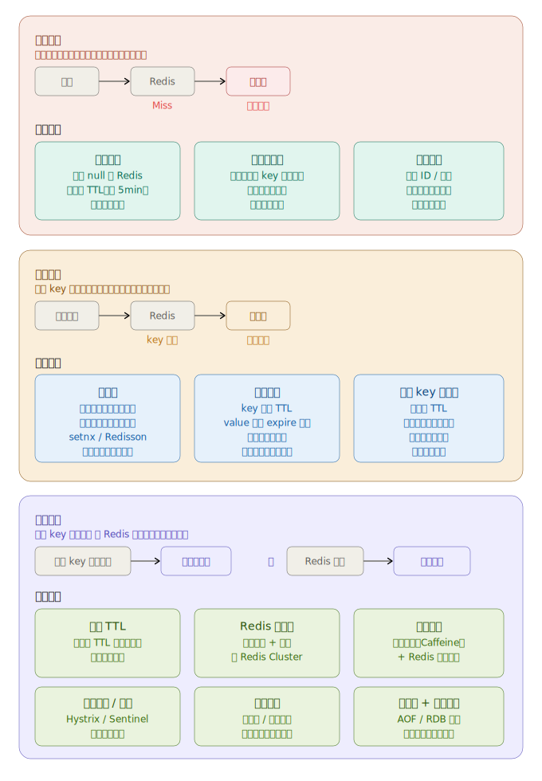

以下是三种问题的核心区分与方案要点：

---

**缓存穿透** — 查询一个数据库中根本不存在的数据，每次都绕过 Redis。常见于恶意攻击或 bug 造成的无效 ID 请求。

首选方案是**布隆过滤器**，在请求进入 Redis 之前就判断 key 是否可能存在，不存在直接拦截，性能极好。**缓存空值**更简单但会浪费内存，需要配合短 TTL。

---

**缓存击穿** — 某个"热点 key"在过期的瞬间被大量并发请求同时打穿，数据库瞬间压力骤增。

两种主流方案各有取舍：
- **互斥锁**：只让一个线程重建缓存，其余等待。强一致性，但有锁等待延迟，推荐用 Redisson 的分布式锁。
- **逻辑过期**：key 永不在 Redis 层过期，value 里存 expire 时间戳，读到"逻辑过期"则异步重建。高可用但短暂有旧数据，适合对一致性要求不极端的场景。

---

**缓存雪崩** — 大量 key 在同一时刻集体失效，或 Redis 服务直接宕机，导致数据库被瞬间压垮，进而整个系统崩溃。

这是三者中最严重的，需要**组合防御**：

1. 过期时间加随机值，避免 key 扎堆到期
2. Redis 主从 + 哨兵或 Cluster，消除单点故障
3. 本地缓存（如 Caffeine）作为第一层，Redis 作为第二层
4. Sentinel / Hystrix 熔断降级，保住数据库最后防线