# 多因子认证（MFA）— 安全令牌认证

## 概述

安全令牌（Security Token）是 MFA 中常见的**"你拥有的东西"**因子，用于生成一次性密码（OTP）或数字签名，验证用户身份。

---

## 令牌类型

### 1. 硬件令牌（Hardware Token）

| 类型 | 工作原理 | 代表产品 |
|------|----------|----------|
| **TOTP 令牌** | 基于时间生成 6~8 位 OTP，每 30s 刷新 | RSA SecurID、飞天令牌 |
| **HOTP 令牌** | 基于计数器生成 OTP，按次递增 | YubiKey（OTP 模式） |
| **FIDO2/U2F Key** | 公私钥挑战-响应，无 OTP | YubiKey、Google Titan Key |
| **智能卡** | 内置证书，PKI 体系 | CAC 卡、eID |

### 2. 软件令牌（Software Token）

- **Authenticator App**：Google Authenticator、Microsoft Authenticator、Authy
- **基于 TOTP/HOTP 标准**（RFC 6238 / RFC 4226）
- 运行在手机或桌面，生成时间同步的 OTP

### 3. 短信 / 邮件 OTP（伪令牌）
- 本质是带外传输的一次性码
- 安全性较低，易受 SIM 劫持、钓鱼攻击

---

## 核心算法

### TOTP（Time-based OTP） — RFC 6238

```
TOTP = HOTP(K, T)
T = floor((Current Unix Time - T0) / X)   // X 通常为 30s
HOTP(K, C) = Truncate(HMAC-SHA1(K, C))
```

- **K**：共享密钥（Base32 编码，服务端与令牌共同持有）
- **T**：时间步长计数器
- **Truncate**：从 HMAC 结果中提取 6~8 位数字

### FIDO2 挑战-响应流程

```
服务端  →  发送 Challenge（随机数）
客户端  →  用私钥签名 Challenge
服务端  →  用公钥验签  →  认证通过
```

私钥**永不离开**设备，彻底防止钓鱼和中间人攻击。

---

## 安全性对比

| 方案 | 防钓鱼 | 防重放 | 防中间人 | 离线可用 | 推荐等级 |
|------|--------|--------|----------|----------|----------|
| SMS OTP | ✗ | ✓ | ✗ | ✗ | ⭐⭐ |
| TOTP App | ✗ | ✓ | ✗ | ✓ | ⭐⭐⭐ |
| HOTP 硬件 | ✗ | ✓ | ✗ | ✓ | ⭐⭐⭐ |
| FIDO2/WebAuthn | ✓ | ✓ | ✓ | ✓ | ⭐⭐⭐⭐⭐ |

---

## 典型集成方案（后端视角）

### Spring Security + TOTP 示例思路

```java
// 1. 用户注册时生成共享密钥
String secret = TOTPUtils.generateSecret(); // Base32，16~32字节
// 2. 生成二维码 URI 供 Authenticator 扫描
String otpAuthUri = "otpauth://totp/App:user@example.com?secret=" + secret + "&issuer=App";

// 3. 验证时
public boolean verify(String secret, String userInputCode) {
    long timeStep = System.currentTimeMillis() / 1000 / 30;
    // 验证当前及前后一个时间窗口，容忍时钟偏差
    for (int i = -1; i <= 1; i++) {
        String expected = TOTP.generateOTP(secret, timeStep + i);
        if (expected.equals(userInputCode)) return true;
    }
    return false;
}
```

### 防重放攻击

```java
// 将已使用的 OTP 存入 Redis，TTL = 时间窗口（60~90s）
String cacheKey = "used_otp:" + userId + ":" + otpCode;
if (redis.exists(cacheKey)) throw new OtpReplayException();
redis.setex(cacheKey, 90, "1");
```

---

## 常见攻击与防护

| 攻击手段 | 描述 | 防护措施 |
|----------|------|----------|
| **实时钓鱼** | 攻击者同步转发 OTP | 使用 FIDO2；绑定 Origin |
| **SIM 劫持** | 转移手机号接收短信 | 禁用 SMS OTP，改用 App/硬件 |
| **OTP 重放** | 在有效期内重复使用 | Redis 去重缓存 |
| **暴力破解** | 穷举 6 位 OTP | 失败次数限流 + 账户锁定 |
| **共享密钥泄露** | 服务端 secret 被盗 | HSM 存储；密钥加密保存 |

---

## 最佳实践

1. **优先选用 FIDO2/WebAuthn**，它是目前唯一真正防钓鱼的标准
2. TOTP 是次选，部署成本低、兼容性好
3. 共享密钥（TOTP secret）应加密存储，不可明文入库
4. 结合**失败限流**（如 5 次失败锁定 5 分钟）防暴力破解
5. 提供**备用恢复码**（Recovery Codes），一次性使用，妥善保存

---

如需深入某个方向（如 FIDO2 后端实现、Spring Security 集成、令牌管理方案），可以进一步展开。

---

这是一个系统性的主题，我来设计完整的架构并配合可视化图示。下面是完整的 Java 实现，分四个部分依次展开。




---

## 一、TOTP 核心算法实现

```xml
<!-- pom.xml 依赖 -->
<dependency>
    <groupId>commons-codec</groupId>
    <artifactId>commons-codec</artifactId>
    <version>1.15</version>
</dependency>
<dependency>
    <groupId>com.google.zxing</groupId>
    <artifactId>core</artifactId>
    <version>3.5.2</version>
</dependency>
```

```java
// TotpService.java — TOTP 核心服务
@Service
@Slf4j
public class TotpService {

    private static final int    SECRET_SIZE   = 20;     // 160-bit 密钥
    private static final int    OTP_LENGTH    = 6;
    private static final int    TIME_STEP     = 30;     // 秒
    private static final int    WINDOW        = 1;      // 允许前后 1 个时间窗口
    private static final String ISSUER        = "MyApp";

    // ──────────────────────────────────────────
    // 1. 生成共享密钥
    // ──────────────────────────────────────────
    public String generateSecret() {
        byte[] buffer = new byte[SECRET_SIZE];
        new SecureRandom().nextBytes(buffer);
        return Base32.encode(buffer);          // 返回 Base32 字符串，存入 DB
    }

    // ──────────────────────────────────────────
    // 2. 生成当前 OTP（用于服务端侧测试）
    // ──────────────────────────────────────────
    public String generateOtp(String base32Secret, long timeStep) throws Exception {
        byte[] key = Base32.decode(base32Secret);
        byte[] data = longToBytes(timeStep);

        SecretKeySpec signingKey = new SecretKeySpec(key, "HmacSHA1");
        Mac mac = Mac.getInstance("HmacSHA1");
        mac.init(signingKey);
        byte[] hash = mac.doFinal(data);

        // Dynamic Truncation（RFC 4226）
        int offset = hash[hash.length - 1] & 0x0F;
        int binary =
            ((hash[offset]     & 0x7F) << 24) |
            ((hash[offset + 1] & 0xFF) << 16) |
            ((hash[offset + 2] & 0xFF) << 8)  |
             (hash[offset + 3] & 0xFF);

        int otp = binary % (int) Math.pow(10, OTP_LENGTH);
        return String.format("%0" + OTP_LENGTH + "d", otp);
    }

    // ──────────────────────────────────────────
    // 3. 验证 OTP（含时间漂移容忍）
    // ──────────────────────────────────────────
    public boolean verifyOtp(String base32Secret, String userOtp) {
        long currentStep = System.currentTimeMillis() / 1000L / TIME_STEP;
        for (int i = -WINDOW; i <= WINDOW; i++) {
            try {
                String expected = generateOtp(base32Secret, currentStep + i);
                if (MessageDigest.isEqual(                // 恒定时间比较，防时序攻击
                        expected.getBytes(StandardCharsets.UTF_8),
                        userOtp.getBytes(StandardCharsets.UTF_8))) {
                    return true;
                }
            } catch (Exception e) {
                log.error("OTP generation error", e);
            }
        }
        return false;
    }

    // ──────────────────────────────────────────
    // 4. 生成二维码 URI（供 Authenticator 扫描）
    // ──────────────────────────────────────────
    public String buildOtpAuthUri(String account, String secret) {
        return String.format(
            "otpauth://totp/%s:%s?secret=%s&issuer=%s&algorithm=SHA1&digits=%d&period=%d",
            URLEncoder.encode(ISSUER, StandardCharsets.UTF_8),
            URLEncoder.encode(account, StandardCharsets.UTF_8),
            secret, ISSUER, OTP_LENGTH, TIME_STEP
        );
    }

    // ──────────────────────────────────────────
    // 5. 生成备份恢复码（一次性）
    // ──────────────────────────────────────────
    public List<String> generateRecoveryCodes(int count) {
        SecureRandom rng = new SecureRandom();
        return IntStream.range(0, count)
            .mapToObj(i -> {
                byte[] b = new byte[5];
                rng.nextBytes(b);
                String hex = HexFormat.of().formatHex(b).toUpperCase();
                return hex.substring(0, 5) + "-" + hex.substring(5); // XXXXX-XXXXX 格式
            })
            .collect(Collectors.toList());
    }

    private byte[] longToBytes(long value) {
        ByteBuffer buffer = ByteBuffer.allocate(Long.BYTES);
        buffer.putLong(value);
        return buffer.array();
    }
}
```

---

## 二、Spring Security 集成

### 2.1 自定义认证令牌与 Provider

```java
// TotpAuthenticationToken.java — 封装双因子认证状态
public class TotpAuthenticationToken extends UsernamePasswordAuthenticationToken {

    // 认证阶段枚举
    public enum Phase { PASSWORD_VERIFIED, FULLY_AUTHENTICATED }

    private final Phase phase;

    // 第一因子通过后使用（半认证状态）
    public TotpAuthenticationToken(UserDetails principal, Phase phase) {
        super(principal, null, phase == Phase.FULLY_AUTHENTICATED
            ? principal.getAuthorities() : Collections.emptyList());
        this.phase = phase;
    }

    public boolean isFullyAuthenticated() {
        return phase == Phase.FULLY_AUTHENTICATED;
    }
}
```

```java
// TotpAuthenticationProvider.java — 第二因子验证
@Component
@RequiredArgsConstructor
public class TotpAuthenticationProvider implements AuthenticationProvider {

    private final TotpService      totpService;
    private final UserMfaRepository userMfaRepo;
    private final OtpReplayGuard   replayGuard;      // Redis 防重放
    private final RateLimiter      rateLimiter;      // 失败限流

    @Override
    public Authentication authenticate(Authentication authentication) throws AuthenticationException {
        TotpAuthenticationToken token = (TotpAuthenticationToken) authentication;
        UserDetails user  = (UserDetails) token.getPrincipal();
        String      otp   = (String) token.getCredentials();

        // 1. 限流检查
        if (!rateLimiter.tryConsume(user.getUsername())) {
            throw new TooManyAttemptsException("OTP验证次数超限，请5分钟后重试");
        }

        // 2. 防重放检查
        if (replayGuard.isReplayed(user.getUsername(), otp)) {
            throw new OtpReplayException("OTP已被使用，请等待下一个时间窗口");
        }

        // 3. 查询用户 TOTP 密钥
        UserMfaConfig mfaConfig = userMfaRepo.findByUsername(user.getUsername())
            .orElseThrow(() -> new MfaNotEnabledException("用户未开启MFA"));

        // 4. 验证 OTP
        boolean valid = totpService.verifyOtp(mfaConfig.getTotpSecret(), otp);
        if (!valid) {
            // 备份码兜底
            valid = verifyRecoveryCode(mfaConfig, otp);
        }
        if (!valid) {
            throw new BadCredentialsException("OTP验证失败");
        }

        // 5. 标记已使用，防重放
        replayGuard.markUsed(user.getUsername(), otp);

        return new TotpAuthenticationToken(user, TotpAuthenticationToken.Phase.FULLY_AUTHENTICATED);
    }

    @Override
    public boolean supports(Class<?> authentication) {
        return TotpAuthenticationToken.class.isAssignableFrom(authentication);
    }

    private boolean verifyRecoveryCode(UserMfaConfig config, String inputCode) {
        return config.getRecoveryCodes().stream()
            .filter(rc -> !rc.isUsed())
            .filter(rc -> BCrypt.checkpw(inputCode, rc.getCodeHash()))
            .peek(rc -> rc.setUsed(true))   // 标记已使用
            .findFirst()
            .map(rc -> { userMfaRepo.save(config); return true; })
            .orElse(false);
    }
}
```

### 2.2 自定义过滤器

```java
// TotpAuthenticationFilter.java — 拦截第二因子请求
@Slf4j
public class TotpAuthenticationFilter extends OncePerRequestFilter {

    private static final String TOTP_ENDPOINT = "/api/auth/mfa/verify";
    private final AuthenticationManager authManager;
    private final ObjectMapper          objectMapper;

    public TotpAuthenticationFilter(AuthenticationManager authManager, ObjectMapper objectMapper) {
        this.authManager  = authManager;
        this.objectMapper = objectMapper;
    }

    @Override
    protected void doFilterInternal(HttpServletRequest  request,
                                    HttpServletResponse response,
                                    FilterChain         chain) throws ServletException, IOException {

        if (!request.getRequestURI().equals(TOTP_ENDPOINT)) {
            chain.doFilter(request, response);
            return;
        }

        // 1. 解析请求体中的 OTP
        MfaVerifyRequest mfaRequest = objectMapper.readValue(
            request.getInputStream(), MfaVerifyRequest.class);

        // 2. 取当前半认证状态的 UserDetails
        Authentication current = SecurityContextHolder.getContext().getAuthentication();
        if (!(current instanceof TotpAuthenticationToken token)
            || token.isFullyAuthenticated()) {
            sendError(response, "请先完成密码认证");
            return;
        }

        try {
            // 3. 构造第二因子 Token 并认证
            TotpAuthenticationToken totpToken =
                new TotpAuthenticationToken((UserDetails) token.getPrincipal(),
                    TotpAuthenticationToken.Phase.PASSWORD_VERIFIED);
            // 通过 credentials 传递 OTP
            ReflectionTestUtils.setField(totpToken, "credentials", mfaRequest.getOtp());

            Authentication fullyAuth = authManager.authenticate(totpToken);

            // 4. 写入 SecurityContext
            SecurityContextHolder.getContext().setAuthentication(fullyAuth);

            sendSuccess(response, "MFA验证成功");

        } catch (AuthenticationException ex) {
            log.warn("MFA verification failed for user: {}", ex.getMessage());
            sendError(response, ex.getMessage());
        }
    }

    private void sendSuccess(HttpServletResponse resp, String msg) throws IOException {
        resp.setContentType("application/json;charset=UTF-8");
        resp.setStatus(HttpServletResponse.SC_OK);
        resp.getWriter().write("{\"success\":true,\"message\":\"" + msg + "\"}");
    }

    private void sendError(HttpServletResponse resp, String msg) throws IOException {
        resp.setContentType("application/json;charset=UTF-8");
        resp.setStatus(HttpServletResponse.SC_UNAUTHORIZED);
        resp.getWriter().write("{\"success\":false,\"message\":\"" + msg + "\"}");
    }
}
```

### 2.3 Security 配置

```java
// SecurityConfig.java
@Configuration
@EnableWebSecurity
@RequiredArgsConstructor
public class SecurityConfig {

    private final TotpAuthenticationProvider totpProvider;
    private final UserDetailsService         userDetailsService;
    private final ObjectMapper               objectMapper;

    @Bean
    public SecurityFilterChain filterChain(HttpSecurity http) throws Exception {
        http
            .csrf(AbstractHttpConfigurer::disable)
            .sessionManagement(sm -> sm
                .sessionCreationPolicy(SessionCreationPolicy.STATELESS))
            .authorizeHttpRequests(auth -> auth
                .requestMatchers("/api/auth/**").permitAll()
                .requestMatchers("/api/mfa/setup").hasRole("USER")
                // 要求完全通过双因子认证
                .anyRequest().access(new MfaFullyAuthenticatedManager()))
            // 密码认证过滤器（第一因子）
            .addFilterBefore(jwtAuthFilter(), UsernamePasswordAuthenticationFilter.class)
            // TOTP 验证过滤器（第二因子）
            .addFilterAfter(
                new TotpAuthenticationFilter(authenticationManager(), objectMapper),
                JwtAuthenticationFilter.class)
            .authenticationProvider(totpProvider);

        return http.build();
    }

    @Bean
    public AuthenticationManager authenticationManager() throws Exception {
        DaoAuthenticationProvider dao = new DaoAuthenticationProvider();
        dao.setUserDetailsService(userDetailsService);
        dao.setPasswordEncoder(passwordEncoder());

        return new ProviderManager(List.of(dao, totpProvider));
    }

    @Bean
    public PasswordEncoder passwordEncoder() {
        return new BCryptPasswordEncoder(12);
    }
}
```

---

## 三、令牌管理方案

### 3.1 数据库设计

```sql
-- 用户 MFA 配置表
CREATE TABLE user_mfa_config (
    id            BIGINT PRIMARY KEY AUTO_INCREMENT,
    user_id       BIGINT       NOT NULL UNIQUE,
    totp_secret   VARCHAR(64)  NOT NULL COMMENT 'Base32加密存储',
    enabled       TINYINT(1)   DEFAULT 0,
    verified_at   DATETIME     NULL COMMENT '首次绑定验证时间',
    created_at    DATETIME     DEFAULT CURRENT_TIMESTAMP,
    updated_at    DATETIME     DEFAULT CURRENT_TIMESTAMP ON UPDATE CURRENT_TIMESTAMP,
    FOREIGN KEY (user_id) REFERENCES users(id)
);

-- 备份恢复码表（每码一行）
CREATE TABLE mfa_recovery_code (
    id          BIGINT PRIMARY KEY AUTO_INCREMENT,
    user_id     BIGINT      NOT NULL,
    code_hash   VARCHAR(64) NOT NULL COMMENT 'BCrypt哈希',
    used        TINYINT(1)  DEFAULT 0,
    used_at     DATETIME    NULL,
    created_at  DATETIME    DEFAULT CURRENT_TIMESTAMP,
    INDEX idx_user_id (user_id)
);
```

### 3.2 Redis 防重放守卫

```java
// OtpReplayGuard.java — 防止 OTP 重复使用
@Component
@RequiredArgsConstructor
public class OtpReplayGuard {

    private final StringRedisTemplate redis;
    private static final long TTL_SECONDS = 90;  // 略大于两个时间步长

    public boolean isReplayed(String username, String otp) {
        String key = buildKey(username, otp);
        return Boolean.TRUE.equals(redis.hasKey(key));
    }

    public void markUsed(String username, String otp) {
        String key = buildKey(username, otp);
        redis.opsForValue().set(key, "1", Duration.ofSeconds(TTL_SECONDS));
    }

    private String buildKey(String username, String otp) {
        // key 中不存储明文 OTP，使用 SHA-256 摘要
        String digest = DigestUtils.sha256Hex(username + ":" + otp);
        return "otp:used:" + digest;
    }
}
```

### 3.3 失败限流器

```java
// RateLimiter.java — 滑动窗口限流
@Component
@RequiredArgsConstructor
public class OtpRateLimiter {

    private final StringRedisTemplate redis;

    private static final int    MAX_ATTEMPTS   = 5;
    private static final long   WINDOW_SECONDS = 300;  // 5 分钟
    private static final String PREFIX         = "otp:attempts:";

    public boolean tryConsume(String username) {
        String key  = PREFIX + username;
        String count = redis.opsForValue().get(key);

        if (count != null && Integer.parseInt(count) >= MAX_ATTEMPTS) {
            return false;   // 超限，拒绝
        }

        // 原子递增，首次设置 TTL
        Long current = redis.opsForValue().increment(key);
        if (current != null && current == 1) {
            redis.expire(key, Duration.ofSeconds(WINDOW_SECONDS));
        }
        return true;
    }

    public void reset(String username) {
        redis.delete(PREFIX + username);
    }
}
```

---

## 四、MFA 注册与管理 API

```java
// MfaController.java
@RestController
@RequestMapping("/api/mfa")
@RequiredArgsConstructor
@Slf4j
public class MfaController {

    private final TotpService      totpService;
    private final UserMfaService   userMfaService;
    private final QrCodeGenerator  qrCodeGenerator;

    // ── 步骤1：生成密钥 + 二维码（用户扫描绑定）────────────────
    @PostMapping("/setup/init")
    public MfaSetupResponse initSetup(@AuthenticationPrincipal UserDetails user) {
        String secret = totpService.generateSecret();
        String uri    = totpService.buildOtpAuthUri(user.getUsername(), secret);
        byte[] qrPng  = qrCodeGenerator.generate(uri, 200, 200);

        // 暂存 secret（未激活，等待验证）
        userMfaService.savePendingSecret(user.getUsername(), secret);

        return MfaSetupResponse.builder()
            .secret(secret)               // 给用户手动录入备用
            .qrCodeBase64(Base64.getEncoder().encodeToString(qrPng))
            .build();
    }

    // ── 步骤2：用户扫码后首次验证，激活 TOTP ─────────────────
    @PostMapping("/setup/verify")
    public ResponseEntity<String> verifyAndActivate(
            @AuthenticationPrincipal UserDetails user,
            @RequestBody @Valid MfaVerifyRequest request) {

        boolean ok = userMfaService.activateMfa(user.getUsername(), request.getOtp());
        if (!ok) {
            return ResponseEntity.badRequest().body("OTP验证失败，请检查时间同步");
        }

        // 激活成功，生成备份码
        List<String> codes = totpService.generateRecoveryCodes(8);
        userMfaService.saveRecoveryCodes(user.getUsername(), codes);

        return ResponseEntity.ok()
            .header("X-Recovery-Codes", String.join(",", codes))
            .body("MFA已启用，请妥善保存恢复码");
    }

    // ── 禁用 MFA ──────────────────────────────────────────────
    @DeleteMapping("/setup")
    public ResponseEntity<String> disableMfa(
            @AuthenticationPrincipal UserDetails user,
            @RequestBody MfaVerifyRequest request) {

        boolean ok = userMfaService.disableMfa(user.getUsername(), request.getOtp());
        return ok
            ? ResponseEntity.ok("MFA已关闭")
            : ResponseEntity.status(403).body("OTP验证失败");
    }

    // ── 重新生成恢复码 ─────────────────────────────────────────
    @PostMapping("/recovery-codes/regenerate")
    public List<String> regenerateRecoveryCodes(
            @AuthenticationPrincipal UserDetails user,
            @RequestBody MfaVerifyRequest request) {

        userMfaService.assertOtpValid(user.getUsername(), request.getOtp());
        List<String> newCodes = totpService.generateRecoveryCodes(8);
        userMfaService.replaceRecoveryCodes(user.getUsername(), newCodes);
        return newCodes;
    }
}
```

---

## 五、关键安全要点总结

| 要点 | 实现方式 |
|------|----------|
| **恒定时间比较** | `MessageDigest.isEqual()` 防时序攻击 |
| **Secret 加密存储** | AES-256 加密后入库，或用 Vault/HSM |
| **OTP 防重放** | Redis TTL 90s，key 用 SHA-256(user+otp) |
| **暴力破解防护** | 5次失败 → 锁定5分钟，Redis 滑动窗口 |
| **时钟漂移容忍** | 验证 T-1、T、T+1 三个时间窗口 |
| **备份码安全** | BCrypt 哈希存储，单次有效 |
| **会话状态分离** | 第一/二因子分阶段认证，JWT 载体携带 phase |

> **完整代码建议**：密钥存储推荐对接 HashiCorp Vault 或 AWS KMS，线上生产环境切勿明文保存 `totp_secret`。