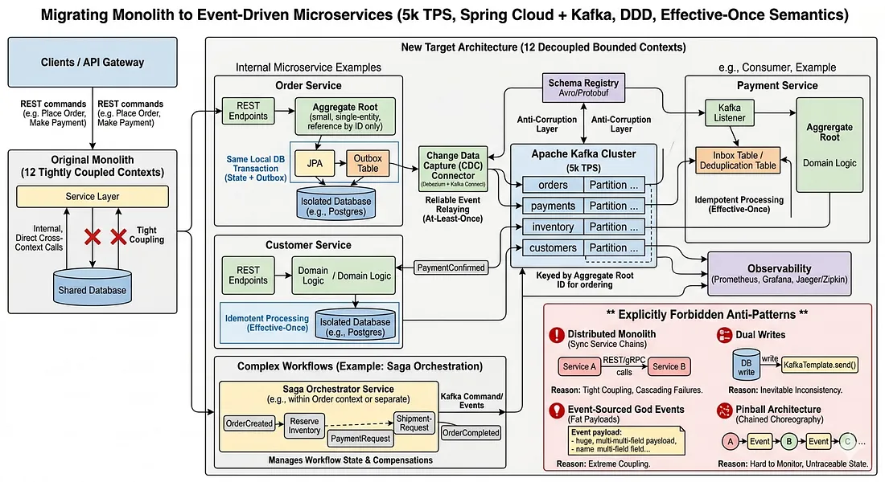

# 将单体 Spring Boot 服务迁移到事件驱动微服务架构

## 背景

当前有一个单体的 Spring Boot 服务（处理 **5k TPS**），正在迁移到使用 **Spring Cloud + Kafka** 的事件驱动微服务架构。原始服务在 12 个有界上下文中紧密耦合了域逻辑。

## 核心设计决策

### 1. 领域驱动设计（DDD）的应用

我将邀请领域专家举办**事件风暴研讨会**，规划业务流程。我们会识别：
- **命令**：触发器
- **聚合**：状态管理器
- **域事件**：结果

在 5000 TPS 下，主要目标是确定事务边界，避免严重的分布式锁定。

### 2. 定义聚合根（AR）

| 原则 | 说明 |
|------|------|
| **保持聚合小** | 聚合根是一个一致性边界。高 TPS 环境下，大型“上帝”聚合会遭遇严重的乐观锁定异常。我会尽可能强制执行单一实体聚合，如 `Order`、`Customer`、`Shipping` |
| **引用完整性** | 聚合必须仅通过 ID 引用其他聚合，绝不能直接引用对象。这加强了边界，并为将其提取到独立微服务铺平道路 |

### 3. 定义事件：领域与集成

必须严格区分**内部域事件**与**外部集成事件**。

| 类型 | 用途 | 机制 |
|------|------|------|
| **领域活动** | 在单一微服务/有界上下文中触发不同聚合体间的副作用 | 通常同步处理或通过内部事件总线（如 Spring Application Events） |
| **整合活动** | 发布给 Kafka，方便跨服务通信。必须充当**反腐败层（ACL）** | 暴露稳定的版本化模式（通过 Confluent Schema Registry 使用 Avro 或 Protobuf），防止生产者内部的更改破坏下游消费者 |

**分区策略**：集成事件必须由**聚合根 ID** 来键控。这确保 Kafka 将特定聚合的所有事件路由到同一分区，保证下游消费者严格的时间顺序排序。

### 4. 维护精确一次性语义（EOS）

作为首席工程师，我必须澄清：跨异构系统（数据库 + Kafka）实现真正的“恰好一次”在物理上是不可能的（否则会有严重性能下降，如两阶段提交）。相反，我们通过多种模式组合实现**有效一次性处理**。

#### 生产者方面：事务性发件箱模式

**问题**：经典的“双写”（保存到 Spring Data JPA 仓库，然后调用 `KafkaTemplate.send()`）本质上存在缺陷。如果数据库提交但 Kafka 宕机，事件就丢失了。

**解决方案**：实现**事务性发件箱模式**
- 持久化域状态的更改，并将事件载荷插入同一本地数据库事务中的单独 `outbox` 表
- 使用像 **Debezium** 这样的工具部署**变更数据捕获（CDC）**，跟踪数据库事务日志（例如 Postgres WAL），并将发件箱记录至少推送到 Kafka 一次

#### 消费者方面：幂等消费者

**问题**：Kafka 保证**至少一次**送达（除非纯粹在 Kafka 内部使用 Kafka Streams）。由于网络重试或消费者组重新平衡，消费者会收到重复消息。

**解决方案**：所有下游的 Spring Boot 微服务必须严格**幂等**
- 实现**收件箱模式**（去重表）
- 在处理消息之前，消费者尝试将事件 ID 插入 `inbox` 表
- 如果发生主键违规，消息为重复，会被安全确认并丢弃
- 或者，设计域逻辑自然幂等（例如用 `UpdateOrderStatus(status=SHIPPED)` 代替 `IncrementShippingCount()`）

## 明确禁止的反模式

为确保架构保持弹性和解耦，我会使用像 **ArchUnit** 这样的工具设置严格的架构护栏，禁止以下行为：

### ❌ 分布式单体（同步服务链）

| 禁止 | 原因 | 替代方案 |
|------|------|----------|
| 服务 A 通过 REST/gRPC 在事务的关键路径中调用服务 B | 耦合运行时间（如果 B 停机，A 会失败），并增加延迟 | A 发布事件，B 异步消费 |

### ❌ 双重写入

| 禁止 | 原因 | 替代方案 |
|------|------|----------|
| 依次写入数据库和消息代理，无需发件箱或 CDC 机制 | 不可避免的数据不一致和脑裂情景 | 使用事务性发件箱模式 |

### ❌ 事件源的神事件（胖载荷）

| 禁止 | 原因 | 替代方案 |
|------|------|----------|
| 在事件中广播聚合的整个状态 | 紧密地将消费者与生产者的内部结构耦合 | 使用**事件通知**（最小负载：`OrderId`、`EventName`，以及用于获取详细信息的超媒体链接）或使用版本化模式精心策划的**事件携带状态传输** |

### ❌ 弹球架构（链式编排）

| 禁止 | 原因 | 替代方案 |
|------|------|----------|
| 复杂的业务流程（例如六步订单履行流程）纯粹以反应式、链式事件形式在 10 个服务间进行，没有中央协调者 | 监控工作流状态或处理复杂补偿变得不可能 | 对于跨越多个上下文的复杂分布式事务，明确使用带有中央编排器（使用状态机）的 **Saga 模式**来处理分布式回滚/补偿事务 |